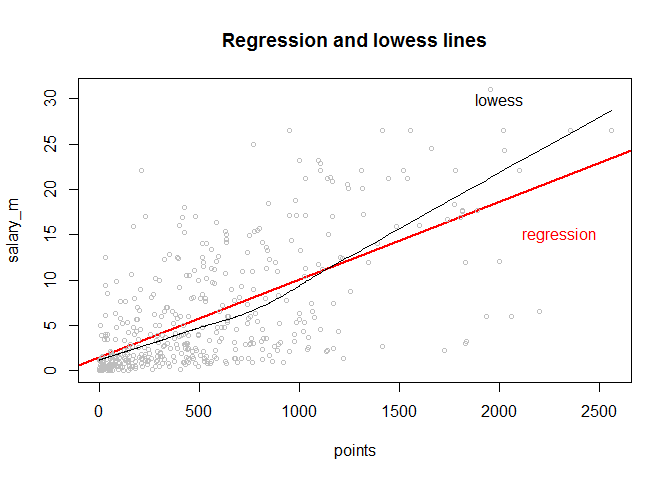

Hw01-xuening-hu
================

### Set up working directory for all chunks

``` r
knitr::opts_chunk$set(root.dir = "/Users/Xuening/STAT133/stat133-hws-fall17/hw01")
```

``` r
getwd()
```

    ## [1] "C:/Users/Xuening/stat133/stat133-hws-fall17/hw01"

``` r
load("nba2017-salary-points.RData")
ls()
```

    ## [1] "experience" "player"     "points"     "points1"    "points2"   
    ## [6] "points3"    "position"   "salary"     "team"

Question 1)
-----------

``` r
# salary in million
salary_m = as.numeric(format(round(salary / 1000000,2),nsmall <- 2))
# replace R by 0
experience_int = replace(experience, experience == "R", "0")
#new position factor
position_factor = factor(position, labels = c("center", "power_fwd", "point_guard", "small_fwd", "shoot_guard"))
#frequency table
table(position_factor)
```

    ## position_factor
    ##      center   power_fwd point_guard   small_fwd shoot_guard 
    ##          89          89          85          83          95

Question 2)
-----------

``` r
plot(points, salary_m, cex = 0.7, col = "red", main = "Scatterplot of Points and Salary")
```


Question 3)
-----------

``` r
n = length(player)

mean_points = mean(points)
mean_points = sum(points)/n

mean_salary = mean(salary_m)
mean_salary = sum(salary_m)/n

var_points = var(points)
var_points = sum((points - mean_points) ^ 2) / (n - 1)

var_salary = var(salary_m)
var_salary = sum((salary_m - mean_salary) ^ 2) / (n - 1)

sd_points = sd(points)
sd_points = sqrt(var_points)

sd_salary = sd(salary_m)
sd_salary = sqrt(var_salary)

cov_points_salary = cov(points, salary_m)
cov_points_salary = sum((points - mean_points) * (salary_m - mean_salary)) / (n - 1)

cor_points_salary = cor(points, salary_m)
cor_points_salary = cov_points_salary / (sd_points * sd_salary)
```

Question 4)
-----------

``` r
b1 = cor_points_salary * (sd_salary / sd_points)
b0 = mean_salary - b1 * mean_points
y_hat = b0 + b1 * points

summary(y_hat)
```

    ##    Min. 1st Qu.  Median    Mean 3rd Qu.    Max. 
    ##   1.509   2.844   5.206   6.187   8.184  23.399

+SO the regression equation is salary = 1.5090766 + 0.0085576 \* points . For increasing of each 1 unit, the salary increase by 0.0085576 unit. When points = 0, salary = 1.5090766.

+The predicted salary is the folloing:

    ## [1] 1.509077

    ## [1] 2.364833

    ## [1] 5.78786

    ## [1] 10.06664

    ## [1] 18.62421

Question 5)
-----------

``` r
plot(points, salary_m, abline(b0, b1, col = "red", lwd = 2), col = "gray", cex = 0.7, lwd = 0.7, main = "Regression and lowess lines")
lines(lowess(points, salary_m))
text(x = 2000, y = 30, labels = "lowess")
text(x = 2300, y = 15, labels = "regression", col = "red")
```



Question 6)
-----------

``` r
# residual
r_residuals = salary_m - y_hat
summary(r_residuals)
```

    ##    Min. 1st Qu.  Median    Mean 3rd Qu.    Max. 
    ## -14.187  -2.792  -1.095   0.000   2.556  18.814

``` r
# residual sum of squares
rss = sum(r_residuals * r_residuals)
# total sum of squares
tss = sum((salary_m - mean_salary) * (salary_m - mean_salary))
# coefficient of determination
rsquare = 1 - rss / tss
```

Question 7)
-----------

``` r
plot(experience_int, salary_m, ylab = "salary", xlab = "years of experience", cex = 0.7, col = "grey", main = "scatterplot with lowess smooth")
lines(lowess(experience_int, salary_m), lwd = 2.5, col = "red")
```


``` r
install.packages("scatterplot3d", repos = "http://cran.us.r-project.org")
```

    ## package 'scatterplot3d' successfully unpacked and MD5 sums checked
    ## 
    ## The downloaded binary packages are in
    ##  C:\Users\Xuening\AppData\Local\Temp\RtmpCItJzG\downloaded_packages

``` r
library(scatterplot3d)
scatterplot3d(x = points, y = salary_m, z = experience_int, color = "pink", main = "3D Scatterplot", ylab = "year of experience", zlab = "salary(millions)")
```


``` r
boxplot(salary_m~position_factor)
```

 +Description and analysis for the plots here +

Question 8)
-----------

-   What things were hard
    -   Utilizing the parameters and adjust the plots
-   What things were easy

+Experience with git: useful + Keep track of every commit + Cooperation +Help for the assignment? Yes. + Help with some usage of functions +How much time + More than 6 hours +Most time consuming part + Graph +Anything not understood

+Frustrating? + None +Exciting? + Struggling instead...
