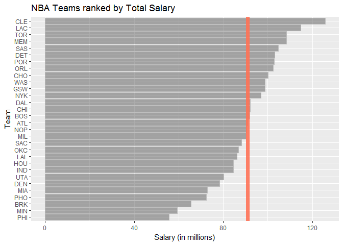
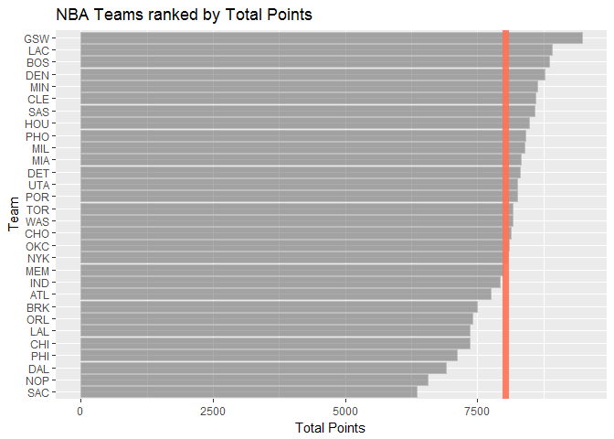
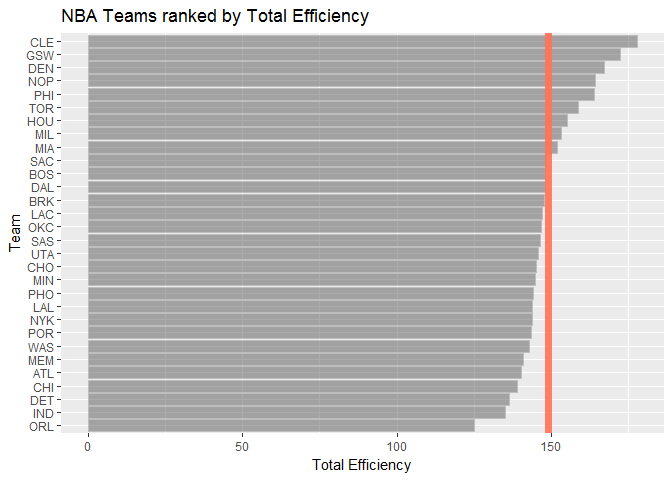
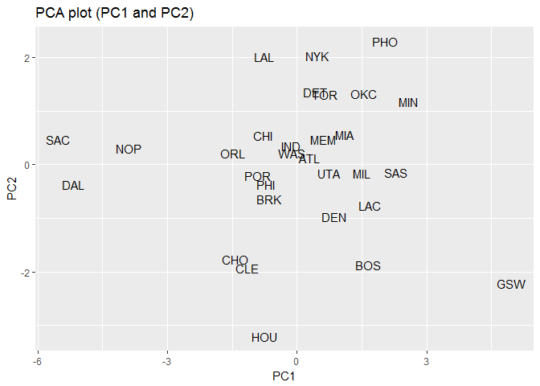
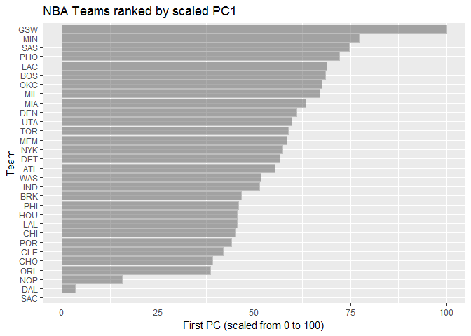

hw03-xuening-hu
================

Set working directory
=====================

``` r
setwd('/Users/Xuening/stat133/stat133-hws-fall17/hw03/report')
library(readr)
library(dplyr)
```

    ## 
    ## Attaching package: 'dplyr'

    ## The following objects are masked from 'package:stats':
    ## 
    ##     filter, lag

    ## The following objects are masked from 'package:base':
    ## 
    ##     intersect, setdiff, setequal, union

``` r
library(ggplot2)
dat_teams <- read.csv('/Users/Xuening/stat133/stat133-hws-fall17/hw03/data/nba2017-teams.csv')
```

Ranking of Teams
================

Basic Rankings
--------------

``` r
ggplot(data = dat_teams,aes(x = reorder(team,salary), y = salary))+
  geom_bar(stat = "identity",colour = 'grey',alpha = 0.5)+
  labs(y = 'Salary (in millions)',x = 'Team',title = 'NBA Teams ranked by Total Salary')+
  coord_flip()+
  geom_hline(yintercept = mean(dat_teams$salary),colour = "coral1", cex = 2.5,alpha = 0.9)
```



``` r
ggplot(dat_teams,aes(x = reorder(team,points), y = points))+
  geom_bar(colour = "grey", stat='identity',alpha = 0.5)+
  labs(y = 'Total Points',x = 'Team',title = 'NBA Teams ranked by Total Points')+
  coord_flip()+
  geom_hline(yintercept = mean(dat_teams$points),colour = "coral1", cex = 2.5,alpha = 0.9)
```



``` r
ggplot(dat_teams,aes(x = reorder(team,efficiency), y = efficiency))+
  geom_bar(colour = "grey", stat='identity',alpha = 0.5)+
  labs(y = 'Total Efficiency',x = 'Team',title = 'NBA Teams ranked by Total Efficiency')+
  coord_flip()+
  geom_hline(yintercept = mean(dat_teams$efficiency),colour = "coral1", cex = 2.5,alpha = 0.9)
```



-   If ranked by the total salary of the team, the first team is CLE and last PHI
-   If ranked by the total points of the team, the first team is GSW and last SAC
-   If ranked by the total points of the team, the first team is GSW and last SAC

Principal Components Analysis (PCA)
===================================

``` r
pca_teams <- select(dat_teams,points3,points2,free_throws,off_rebounds, def_rebounds, 
                    assists, steals, blocks, turnovers, fouls)

pca <- prcomp(pca_teams, scale = TRUE)

names(pca)
```

    ## [1] "sdev"     "rotation" "center"   "scale"    "x"

``` r
eigenvalue <- data.frame(
  eigenvalue = round(pca$sdev^2, 4),
  prop = round(pca$sdev ^ 2 / sum(pca$sdev ^ 2), 4),
  cumprop = cumsum(round(pca$sdev ^ 2 / sum(pca$sdev ^ 2), 4))
  )
eigenvalue
```

    ##    eigenvalue   prop cumprop
    ## 1      4.6959 0.4696  0.4696
    ## 2      1.7020 0.1702  0.6398
    ## 3      0.9795 0.0980  0.7378
    ## 4      0.7717 0.0772  0.8150
    ## 5      0.5341 0.0534  0.8684
    ## 6      0.4780 0.0478  0.9162
    ## 7      0.3822 0.0382  0.9544
    ## 8      0.2603 0.0260  0.9804
    ## 9      0.1336 0.0134  0.9938
    ## 10     0.0627 0.0063  1.0001

``` r
pca_x <- as.data.frame(pca$x)
pca_x[, "team"] <- dat_teams[, "team"]

ggplot(data = pca_x, aes(x = PC1, y = PC2))  +
  geom_text(aes(label = pca_x$team))+
  labs(title = "PCA plot (PC1 and PC2)")
```

 \#\#\# Index based on PC1

``` r
s1 <- 100 * (pca$x[, 1] - min(pca$x[, 1])) / (max(pca$x[, 1]) - min(pca$x[, 1]))
s1_table <- as.data.frame(s1)
s1_table[, "team"] = dat_teams[, "team"]

ggplot(data = s1_table, aes(x = reorder(s1_table$team, s1_table$s1), y = s1)) +
 geom_bar(stat = "identity",colour = 'grey',alpha = 0.5) +
 coord_flip() +
 ggtitle("NBA Teams ranked by scaled PC1") +
  xlab("Team") +
  ylab("First PC (scaled from 0 to 100)")
```



-   GSW ranks highest on the PC1 index, while SAC ranks lowest.

Comments and Reflections
========================

-   Was this your first time working on a project with such file structure? If yes, how do you feel about it?
    yes, it's my first time to work with PCA, I got lost on the fomular for a while.
-   Was this your first time using relative paths? If yes, can you tell why they are important for reproducibility purposes?
    no
-   Was this your first time using an R script? If yes, what do you think about just writing code?
    yes, it's not as convienence as RMD
-   What things were hard, even though you saw them in class/lab?
    the PCA lets me struggle for a long while, and the graph reorder
-   What things were hard, even though you saw them in class/lab?
    the graph and the prcomp
-   Did anyone help you completing the assignment? If so, who?
    yes, my GSI, Andy
-   Did anyone help you completing the assignment? If so, who?
    more than 6 hours
-   What was the most time consuming part?
    PCA
-   Was there anything interesting? emmmmmmm........

R Markdown
----------

This is an R Markdown document. Markdown is a simple formatting syntax for authoring HTML, PDF, and MS Word documents. For more details on using R Markdown see <http://rmarkdown.rstudio.com>.

When you click the **Knit** button a document will be generated that includes both content as well as the output of any embedded R code chunks within the document. You can embed an R code chunk like this:

``` r
summary(cars)
```

    ##      speed           dist       
    ##  Min.   : 4.0   Min.   :  2.00  
    ##  1st Qu.:12.0   1st Qu.: 26.00  
    ##  Median :15.0   Median : 36.00  
    ##  Mean   :15.4   Mean   : 42.98  
    ##  3rd Qu.:19.0   3rd Qu.: 56.00  
    ##  Max.   :25.0   Max.   :120.00

Including Plots
---------------

You can also embed plots, for example:


Note that the `echo = FALSE` parameter was added to the code chunk to prevent printing of the R code that generated the plot.
