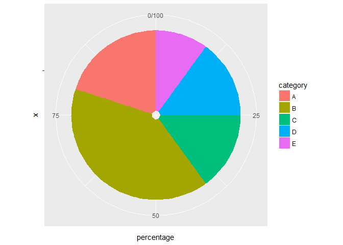
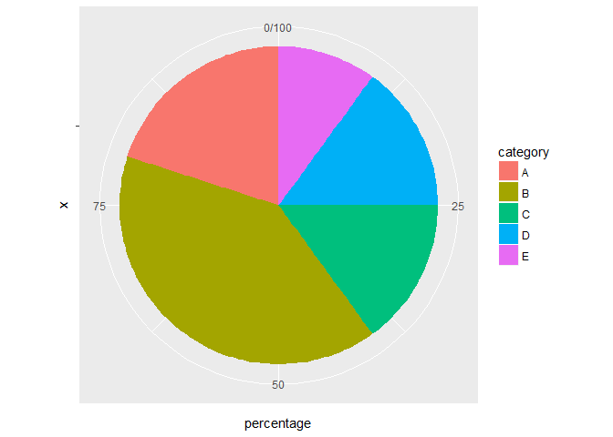
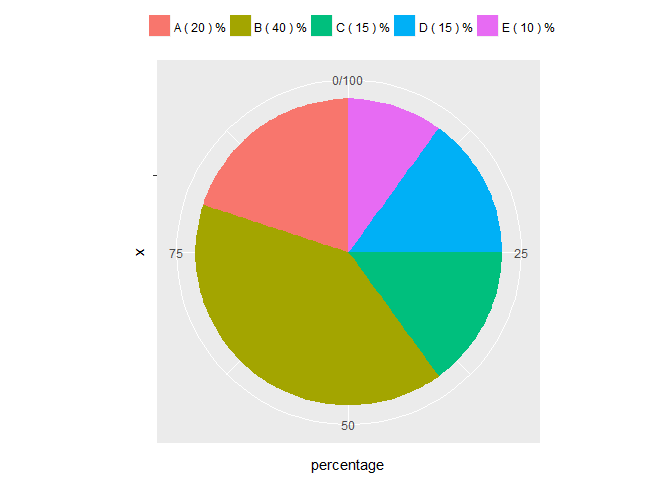

post1-xuening-hu
================
Xuening Hu

### Seting wd

``` r
setwd("/Users/Xuening/STAT133/stat133-hws-fall17/post1")
```

The History of Statistics and Data Visualization
================================================

> -   The general introduction of the Statisics and data visualization
> -   How data visualization affect the advance of statistics
> -   A few example of data visualization, such as maping,pie-graph

Introduction
------------

-   Can you imagine that you have to remember all the probabilities of the normal
    standard distribution? Can you think about all the geographic maps you have to
    draw by hand? Can you guess what does the first graph contain in the long human
    history river? No human can single handily remember every data and sort the
    valuable data when it is necessary. In this case, the Statistics started to
    help people organize the experience and forecast possible diversifications.
    However, along with the improvement of human society, there are too many data
    need to be collected and it is very hard for regular user to find their ideal
    data to help them doing their works. Now, data visualization started to improve
    the statistics and help user to understand the data they possess and make better decisions
-   The graphic portrayal of quantitative has a long history which from 6200 BC.
    The visualizing usage began from the requirement of navigation and world-wide
    exploration especially in the early 16 century. We can find so many pretty
    local map, or ocean map, even “pre-globle” maps from that period. I really
    surprised when I heard it firstly because it was totally out of my imagination.
    No wonder there is an old quotation that, “The only new thing in the world is
    the history you don’t know” which from Harry S Truman. The history of data
    visualization is more like a fantasy literature which has more fun compared
    with the content we have learned from the lecture(LOL). My post supposes to
    rise your interesting in data visualization since it is a significant compose
    of this class. To be honestly, my understanding on R visualization enhanced
    after the research and I wish you can have more fun after read my post.

Content
-------

-   Like I mentioned above, the earliest geometric diagrams was formed from the
    requirement of the great geographical discovery period (from the end of the
    15th century to the beginning of the 16th century) which called “thematic
    cartography” nowadays. In that age, the world wide exploded people’s mind
    that the world is much vast than they have known. From now on, it illustrates
    that the graphical visualization is a tool that helps humans to explain the
    world view in a visualized way. However, as the advance of statistics, data
    visualization or data visualization is viewed by many disciplines as a modern
    equivalent of visual communication. It involves the creation and study of the
    visual representation of data, meaning "information that has been abstracted
    in some schematic form, including attributes or variables for the units of
    information”(Friendly, 2). I believe that the development of statistics
    could not leave the changes of data visualization. Generally, we said the
    most starting point of” statistics” as an subject at 1749, which is also
    the new graphic forms appeared. The form of graphs became more and more
    abstract and efficient. People realized that the table and the map are
    better way to organize and analysis some complex information, like the
    population collection by the landlord class. The dominator has more demand
    on controlling the tendency of his civilians so that more mathematicians
    decided to focus on the data collection and visualization.  
-   Many scholars argued that data visualization would help Statistics to
    improve in many different levels. One opinion is that using proper
    data visualization techniques would help user saving time and energy
    finding valuable information and making the best decision for them.
    In the article “Correction: From Static to Interactive: Transforming
    data visualization to Improve Transparency.” Professor Weissgerber
    discovered that how data visualisation would help statistics itself and
    people who trying to use the related stats to understand the data and help
    them making the right decisions. He wrote that “Customized interactive
    graphics have already been presented by journals and authors to complement
    research articles. Anecdotal reports suggest that this can be an effective
    strategy for increasing interest in published research. Interactive data
    visualization could fundamentally change the way authors, reviewers, and
    readers understand and interpret research data (Weissgerber 6).” No doubt,
    using data visualization would definitely improve the transparency which
    relates to mutable areas, including writing, marketing and even scientific
    experiments. Another peer-reviewed journal wrote about their experiment on
    how data visualization help engineers and decision-makers achieve their
    long-term goals through comprehensive and well-rounded planning and analyzing
    data in the entire process (Capuder 2871).

### Image


Figure 2: Planetary movements shown as cyclic inclinations over time, by an unknown astronomer,
appearing in a 10th century appendix to commentaries by A. T. Macrobius on Cicero’s
In Somnium Scripionus. Source: Funkhouser (1936, p. 261).

Code
----

The example I choose is using the ggplot to draw a pie-graph because not only in
the RStudio but also in the spreadsheet format, PowerPoint format, LaTex format,
pie-graph is a vivid and useful graph to analysis.

``` r
library(ggplot2)
# dummy dataframe
df1 <- data.frame(percentage = c(20, 40, 15, 15, 10), 
                  category = c("A", "B", "C", "D", "E"))
# first to creat a histogram that stacks all percentages on one bin
step1_1 <- ggplot(data = df1, aes(x = "", y = percentage, fill = category)) +
  geom_bar(stat = "identity")
# then convert the cordinate into polar cordinate
step1_2 <- step1_1 + coord_polar(theta = "y")
step1_2
```



``` r
# to eliminate the blank in the middle
step1_3 <- step1_2 + geom_bar(stat = "identity",width = 1)
step1_3
```



``` r
# to move the legend to the top, and add percentage
Percentage_label <- as.vector(df1$category)
Percentage_label <- paste(Percentage_label, "(", df1$percentage, ")", "%")

step1_4 <-  step1_3 + theme(legend.title = element_blank(), 
                            legend.position = "top") + 
  scale_fill_discrete(breaks = df1$category, labels = Percentage_label) 
step1_4
```



``` r
# to remove the white line around the pie but add to the graph
step1_5 <- step1_4 + theme(axis.text.x = element_blank()) + 
  geom_text(aes(x = 0.9, y = c(90,60,33,17,10), 
                label = Percentage_label), 
            size = 3)
step1_5
```


Funny graph
-----------

[Making map step by step](http://www.kevjohnson.org/making-maps-in-r/)

[Short interactive lines video](http://www.youtube.com/watch?v=IFYVDCWr1XQ/)

Take-home message
-----------------

> The only new thing in the world is the history you don’t know. —Harry S Truman

-   The process of the advance of statistics and data visualization has
    soooo many fun to explore :thumbsup:

Conclusion
----------

-   Many experts also believe that the reason why data visualisation started to
    play an important role in Statistics because of the content or informational
    capacity which need to be count have grown richer. The content is so richer
    that it makes user very difficult to find the data they want to use and they
    don’t know the best way to find valuable information behind those data(Smith 175).
    Under this circumstance, the effect of data visualization appears. Through proper
    data visualisation techniques, user will find their rich and complicated data
    becomes a high-quality resource that will easily help them doing their tasks.

Source
------

[A Brief History of Data Visualization](http://www.datavis.ca/papers/hbook.pdf)
[Milestone project](http://www.math.yorku.ca/SCS/Gallery/milestone/milestone.pdf)
**Three More** sources as pdf are put in the post 1 file on the Github,
please check if you interested

### Works Cited(All attached in my folder)

-   Capuder, Tomislav, et al. “Visualization of distribution system planning for engineers
    and decision-Makers.” Turkish Journal Of Electrical Engineering & Computer Sciences,
    vol. 25, 2017, pp. 2871–2884., <doi:10.3906/elk-1602-178>.
-   Friendly, Michael (2008). "Milestones in the history of thematic cartography,
    statistical graphics, and data visualization"
-   Smith, Alan. “Data Visualisation and Beyond: A Multidisciplinary Approach to
    Promote User Engagement With Official Statistics” Statistical Journal
    of the LAOS, vol. 29, pp173-185, 2013, DOI 10.3233/SJI-130783.
-   Weissgerber, Tracey L., et al. “Correction: From Static to Interactive:
    Transforming Data Visualization to Improve Transparency.” PLOS Biology,
    vol. 14, no. 8, 2016, <doi:10.1371/journal.pbio.1002545>
